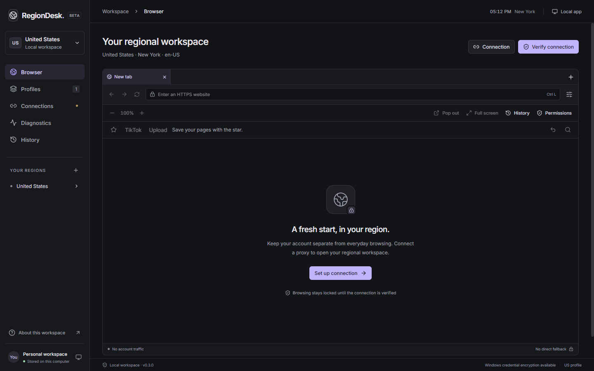
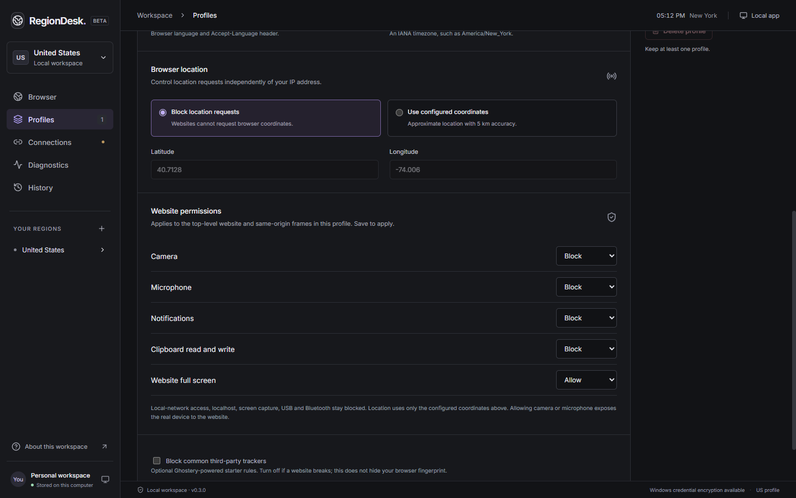

<div align="center">

# RegionDesk

**Separate profiles. Consistent regional settings. A browser you control.**

A Windows desktop workspace for isolated browser sessions, verified proxy routing and regional preferences.


[Getting started](#getting-started) · [Browser controls](#browser-controls) · [How it works](#how-it-works) · [Documentation](#documentation)

</div>



## Your accounts, kept separate

RegionDesk embeds Chromium inside a local desktop app. Each profile keeps its own cookies, site storage, proxy configuration and regional preferences. Bring your own proxy, verify the connection, then browse and sign in normally.

| Capability | What you get |
| --- | --- |
| **Isolated profiles** | Persistent cookies, cache and storage per profile, with explicit session clearing. |
| **Regional preferences** | Language, timezone and optional configured coordinates, plus presets for 12 countries. |
| **Verified connections** | Authenticated HTTP, HTTPS and SOCKS5 upstream proxy support; country and reported timezone checks before browsing. |
| **Saved tabs and history** | Per-profile tabs, recent history and address suggestions; selected tabs restore after verification. |
| **Flexible browsing** | Page zoom, a native context menu, a floating window and full-screen mode using the same session. |
| **Permission controls** | Profile settings for camera, microphone, notifications, clipboard and website fullscreen. |
| **Visible evidence** | Observed browser/network readings, an activity log and credential-free diagnostic exports. |
| **Local credential storage** | Proxy passwords encrypted with Electron safeStorage on Windows. |

No app subscription or bundled proxy. Website logins, uploads and publishing remain user-controlled.

## Getting started

### Run from source

**Windows double-click setup:** extract or clone the complete project into the folder where you want to keep it, then run **`Setup.bat`**. It reuses compatible Node.js (22.12+ on the 22.x line, or 24+) and installed dependencies. If Node is missing, it downloads a checksum-verified portable runtime into `.tools/`. Missing or mismatched dependencies are installed from `package-lock.json`, then the app is built in that same folder. No administrator install or system PATH change is needed.

Launch with **`Start RegionDesk.bat`**. It also runs setup if dependencies or build files are missing. Run `Setup.bat` again after updating the source. Keep the scripts with the complete project; the BAT file alone does not contain the app. Initial downloads need internet access. Existing profiles and website data continue to use `%APPDATA%/RegionDesk`.

For unattended setup, use `Setup.bat --no-pause`; a failed step returns a nonzero exit code. Dependency-check details are saved in `.setup/dependencies.log`.

For manual setup, install **Git** and a compatible **Node.js** version on Windows:

```powershell
git clone https://github.com/leobbaroni/RegionDesk.git
cd RegionDesk
npm ci
npm run dev
```

For a production build:

```powershell
npm run build
npm start
```

### Connect your first profile

1. Open **Profiles**, choose a region preset or enter your preferences, then save.
2. Open **Connections** and enter your proxy host, port and credentials.
3. **Save connection**, then **Verify connection**. The reported country and any reported timezone must match the profile.
4. Open **Browser**, enter an HTTPS address or use a shortcut, and sign in yourself.

No traffic is sent to account websites until verification succeeds. Provider comparison links open in your regular browser; account browsing stays inside RegionDesk.

### Build a portable Windows app

```powershell
npm run package
Expand-Archive release/RegionDesk-0.1.6-Windows.zip release/RegionDesk-Windows
.\release\RegionDesk-Windows\RegionDesk.exe
```

Keep all extracted files together. Close the app before replacing files, and reuse the same folder for updates. The build is unsigned and portable; it does not change Windows' system proxy, language or timezone. The ZIP format avoids a verified launch issue with self-extracting executables running from Windows Temp.

## Browser controls

| Action | Control |
| --- | --- |
| Focus the address bar | `Ctrl+L`; type to search this profile's history |
| Manage tabs | Drag tabs to reorder; `Ctrl+T`, `Ctrl+W`, `Ctrl+Tab` / `Ctrl+Shift+Tab`; Shift+Left/Right also reorders |
| Browse history | **History** or `Ctrl+H` |
| Zoom in / out | Toolbar buttons or `Ctrl` + `+` / `-` while the page is focused |
| Reset zoom | Click the zoom percentage or press `Ctrl+0` |
| Open a floating browser | **Pop out** for tabs, address bar and page controls; closing it returns the page to the workspace |
| Enter / leave full screen | **Full screen**, `F11`, or `Esc` to leave |
| Edit site permissions | **Permissions** → profile settings → save and reverify |
| Copy, paste and navigate | Right-click the page for its native menu |

<details>
<summary><strong>Preview the permission controls</strong></summary>



Screenshots use a fresh, isolated local profile without personal accounts or proxy credentials.

</details>

## How it works

Each profile uses a persistent Electron session. A loopback-only bridge connects that session to your configured upstream proxy. Connection verification requests IP geolocation through the same route and checks it against the profile before unlocking browsing.

- **Routing:** fixed proxy configuration with no direct fallback. Chromium destination DNS resolution and DNS prefetching are blocked; the bridge resolves the upstream proxy's hostname.
- **Regional consistency:** language, timezone and genuine browser metadata are applied to the page and supported child contexts. Dedicated workers and cross-site frames have regression coverage.
- **Connection lifetime:** successful checks grant a 90-second lease, normally renewed every 45 seconds. Transient HTTP 429 responses trigger a cooldown and bounded retries without discarding a still-verified page. Rate limits never extend the lease.
- **Permissions:** location is blocked or uses configured coordinates. Local-network access, loopback access, screen capture and device permissions remain blocked. Non-proxied WebRTC UDP is restricted and QUIC is disabled.
- **Failure handling:** an expired check, region mismatch or route failure locks browsing. Saved website sessions are retained.

**Windows Firewall:** the bridge listens on `127.0.0.1` and does not need incoming LAN access. Cancel an incoming-network permission prompt. Keeping the executable at the same path avoids creating a new app path for every update. RegionDesk does not modify firewall rules.

### What verification establishes

Verification confirms the proxy's reported country and timezone at the time of the check. It does not establish residential/mobile origin, account eligibility, CAPTCHA-free access or audience distribution. The real browser engine and hardware remain observable.

Embedded-browser compatibility can differ from Chrome. Downloads and external app protocols are blocked; popups open new managed tabs within the same profile. Live TikTok login, publishing and audience distribution have not been verified. See [TESTING.md](TESTING.md) for the full evidence boundary.

## Development and verification

| Command | Purpose |
| --- | --- |
| `npm run dev` | Start the development app |
| `npm run build` | Type-check and build the renderer and Electron processes |
| `npm test` | Run unit tests |
| `npm run test:desktop` | Exercise the real app with an isolated HTTPS/proxy fixture |
| `npm run package` | Build the Windows portable ZIP |
| `node scripts/package-smoke.mjs` | Check the unpacked packaged app |
| `powershell -NoProfile -ExecutionPolicy Bypass -File scripts/portable-smoke.ps1` | Verify normal launch from the extracted ZIP |

The **v0.1.6 verification run** passed 10 unit tests, 27 desktop test groups and both packaged-launch checks. It covers drag reordering in both windows, floating tabs and address/history controls, multiple live tabs, popup handling, per-profile history and saved-tab restoration. The earlier v0.1.4 live proxy check confirmed matching outgoing IP, language and timezone before and after moving a page into the floating window. These are recorded results, not continuous-integration badges.

Desktop tests require OpenSSL; the default Windows path uses Git's bundled copy. Set `OPENSSL_BIN` to override it. Tests use separate data under `.test-data/` and a fixture-specific certificate pin that packaged builds ignore.

```text
electron/       Main process, proxy bridge, profile storage and IPC
src/            React workspace and styles
shared/         Profile, runtime and API types
scripts/        Build, desktop verification and packaging checks
tests/          Unit tests
docs/           Controls, verification notes and integration research
```

## Local data

Settings and encrypted proxy credentials live under `%APPDATA%/RegionDesk`; website data is stored in separate `Partitions/regiondesk-<id>` directories. Password encryption is tied to the Windows account. Diagnostic exports include the measured public IP, but omit proxy credentials, cookie values and browsing URLs.

Tab URLs, titles, order, selection and the latest 500 unique history URLs are saved locally in `browsing.json` without encryption. Each profile supports up to 32 tabs. Restored tabs wait for successful verification; only the selected tab loads until you select others. Address suggestions use that profile's history. Form and password autofill are not included.

**Clear history** removes the current profile's history and suggestions while keeping open tabs and website data. **Clear session** removes a profile's local website data while retaining its settings. **Delete profile** removes its local settings, credentials, saved tabs, history and website data after confirmation. Neither action deletes an online account.

## Documentation

- [Browser controls, 429 recovery and Windows Firewall](docs/BROWSER_CONTROLS.md)
- [Test coverage and known limitations](TESTING.md)
- [Proxy provider comparison](docs/PROXY_OPTIONS.md)
- [Google compatibility investigation](docs/GOOGLE_VERIFICATION.md)
- [Related projects and integration decisions](docs/RELATED_PROJECTS.md)
- [Design system](DESIGN.md)

## License

No open-source license has been granted for RegionDesk (`UNLICENSED`). Third-party dependencies retain their respective licenses.
